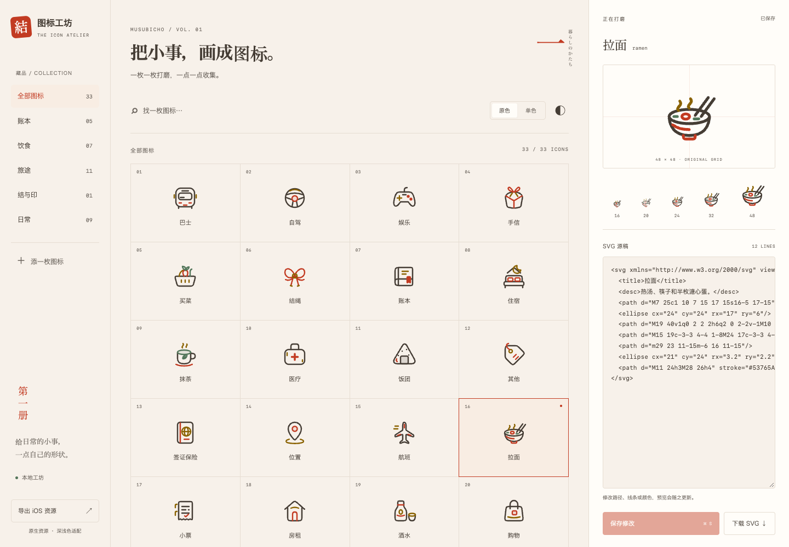

<p align="center">
  
</p>

<h1 align="center">結 · Icon Atelier</h1>

<p align="center">Soft shapes for everyday things.<br />把小事，画成图标。</p>

A collection of **90 SVG originals** and a local workshop for refining them one at a time. Created for [Musubicho](https://github.com/musubicho), with the same shapes available for Web and native iOS.

Rounded outlines, warm ink, vermilion, gold, and matcha green. The collection covers all **24 expense categories** and **7 itinerary types** used in Musubicho, plus ledger, receipt, wallet, split, transfer, and knot motifs, and the interface icons that replace SF Symbols in the app's menus, rows, and empty states.


## The workshop

- Browse and search by name, filename, or collection.
- Edit SVG source with live previews at **16, 20, 24, 32, and 48 px**.
- Check original colors or monochrome in light and dark appearances.
- Save directly to `icons/`, with checks that protect edits made in another editor.
- Download one SVG or export the entire collection as an Xcode asset catalog.



## Run locally

Requires **Python 3.10+** and a modern browser. No packages or build step are needed.

```sh
git clone https://github.com/musubicho/icon-workshop.git
cd icon-workshop
python3 server.py
```

Open **<http://127.0.0.1:4173>**. To use another port:

```sh
python3 server.py --port 4174
```

The server binds to localhost. Editing and exporting happen on your computer, with no cloud service or AI calls. The workshop UI is currently in Chinese.

## Refine an icon

1. Select an icon and edit its **SVG 源稿** (SVG source). The large preview and size strip update as you type.
2. Switch **原色 / 单色** (original / monochrome) and the light / dark toggle to check contrast and small-size clarity.
3. Click **保存修改** (save), or press **⌘S / Ctrl+S**. Originals remain in `icons/*.svg`.
4. Use **下载 SVG** to download the current preview, or **导出 iOS 资源** to export all saved icons.

Use **添一枚图标** to create a new source file. IDs start with a lowercase letter and contain only lowercase letters, digits, and hyphens, up to 64 characters. The ID becomes the filename and iOS resource name.

You can also edit files in an external vector editor and refresh the workshop. If a file has changed elsewhere, saving reports a conflict and leaves that file intact.

> [!NOTE]
> Individual SVG downloads include the current preview, including unsaved edits. The iOS export uses saved originals; save your changes before exporting.

## Use on the Web

Use an original from `icons/`, or a downloaded SVG with the chosen colors and appearance:

```html

```

For an icon that follows text color, download a monochrome SVG and use it as a CSS mask:

```css
.icon {
  display: inline-block;
  width: 24px;
  height: 24px;
  background-color: currentColor;
  mask: url("/icons/ramen-mono-light.svg") center / contain no-repeat;
}
```

Provide an accessible label when an icon conveys meaning on its own. A downloaded original-color SVG contains the selected appearance; choose the appropriate light or dark file in your application.

## Use on iOS

Choose **原色** or **单色**, then click **导出 iOS 资源**. Unzip the download and add `MusubiIcons.xcassets` to your app target in Xcode.

| Export | Native behavior |
| --- | --- |
| Original colors | Separate light and dark assets, selected automatically by the system |
| Monochrome | Template images that follow your foreground color or UIKit tint |

Resource names use `musubi-<id>`, such as `musubi-ramen`. Assets have an intrinsic size of **24 pt** and preserve their vector representation for scaling.

```swift
// SwiftUI
Image("musubi-ramen")
    .resizable()
    .scaledToFit()
    .frame(width: 24, height: 24)

// UIKit
UIImage(named: "musubi-ramen")
```

These are native image sets. Symbol weight variants, text-baseline alignment, and SF Symbol animations require separately authored custom symbol templates.

## Drawing conventions

- **48 × 48** source grid, **2.4 px** strokes, round caps and joins.
- Use curved geometry for soft corners: arcs, Bézier curves, and rounded shapes. Keep small details readable at 16–24 px.
- Give each SVG a `<title>` for its display name and a `data-category` for its collection.
- Use paths and basic shapes with direct `fill` / `stroke` attributes. Convert text to paths.
- Pair colored outlines with quiet, neutral backgrounds.

The four palette colors adapt between appearances:

| Color | Light | Dark |
| --- | --- | --- |
| Ink | `#453D35` | `#EFE4D7` |
| Vermilion | `#C23B22` | `#FF7A5C` |
| Gold | `#8A6200` | `#E0A526` |
| Matcha | `#53765A` | `#9FBC91` |

Custom colors retain their original values in color previews and exports, so check their contrast in both appearances. The SVG validator accepts paths and basic shapes; scripts, external references, CSS styles, filters, text, and embedded bitmaps are unsupported.

## Collections

| Collection | Icons |
| --- | --- |
| Ledger · 账本 | Guest, ledger, receipt, split, transfer, wallet |
| Food · 饮食 | Groceries, matcha, onigiri, ramen, sake, taiyaki, takeout |
| Travel · 旅途 | Bus, drive, gift, lodging, passport, pin, plane, sight, taxi, ticket, train, walk |
| Everyday · 日常 | Entertainment, medicine, other, rent, shopping, SIM, subscription, tissue, top-up, utilities |
| Interface · 界面 | Calendar, camera, chats, clear, clock, cloud, copy, database, delete account, developer, device, directions, done, edit, failed, filter, fit, folder, forget, hide, info, invite, language, later, layers, link, list, locate, map, memory, model, nearby, note, photo, privacy, profile, refresh, reschedule, scan, schedule, seal, search, settings, share, sheet, sign out, sparkle, stats, storage, swap, trash, undo, usage, want |
| Knot · 结与印 | Knot |

## Project files and checks

| Path | Purpose |
| --- | --- |
| `icons/` | Editable SVG originals; the source of all exports |
| `web/` | Browser UI, styles, and preview logic |
| `server.py` | Python standard-library server, validation, saving, and iOS export |
| `test_workshop.py` | Save-conflict, SVG-validation, and asset-export checks |

```sh
python3 -m unittest -v
```
