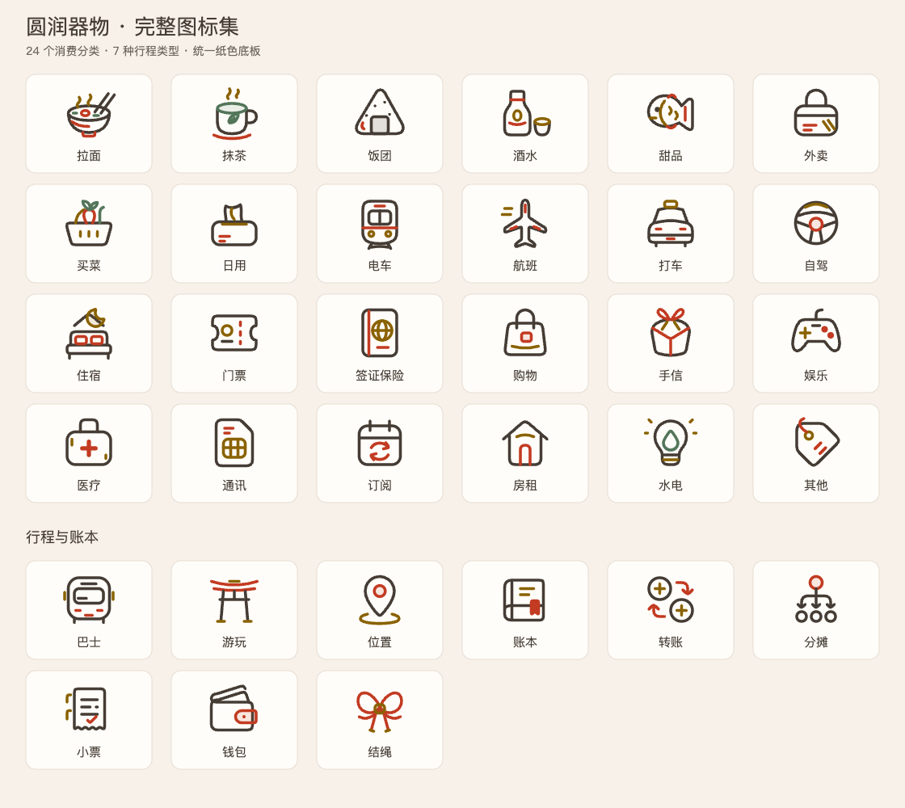

<p align="center">
  
</p>

<h1 align="center">Nyatabi Icons</h1>

<p align="center">把旅途里的小事，画成图标。<br />Soft shapes for everyday things.</p>

A collection of **93 SVG originals** drawn for [Nyatabi](https://nyatabi.app), with the same shapes available for Web and native iOS. Browse them at **<https://icons.nyatabi.app>**.

Rounded outlines, warm ink, vermilion, gold, and matcha green. The collection covers the expense categories and itinerary types used in Nyatabi, ledger, receipt, wallet, split, transfer, and knot motifs, and the interface icons that replace SF Symbols in the app's menus, rows, and empty states. The site's own interface uses only icons from this collection.



## The site

- Search by name, ID, or collection; press <kbd>/</kbd> to focus the search box.
- Switch the grid between original colors and monochrome, and the whole site between light and dark.
- Each icon has its own page at `/icon/<id>`: light and dark previews, sizes from 16 to 48 px, copy or download the SVG in original colors or as `currentColor`.
- Export the entire collection as an Xcode asset catalog.

The site is a SvelteKit app prerendered to static files. Editing is only available in the local dev server.

## Run locally

Requires **Node.js 22.17+** and **pnpm**.

```sh
git clone https://github.com/musubicho/icon-workshop.git
cd icon-workshop
pnpm install
pnpm dev
```

Open the URL Vite prints (port **4173** by default). The dev server binds to localhost, and its save endpoint only accepts same-origin requests from `localhost` or `127.0.0.1`.

## Refine an icon

Read the drawing rules in [docs/icon-guidelines.md](docs/icon-guidelines.md) first: stroke width, palette, spacing between lines, and the self-check before each change.

1. Open an icon's page. In dev mode, the **SVG 源稿** editor appears in the side panel; previews update as you type.
2. Click **保存修改** or press **⌘S / Ctrl+S** to write the file in `icons/`.
3. Use **添一枚图标** on the home page to create a new source file. IDs start with a lowercase letter and contain only lowercase letters, digits, and hyphens, up to 64 characters. The ID becomes the filename and iOS resource name.

You can also edit files in an external vector editor. If a file has changed elsewhere, saving reports a conflict and leaves that file intact.

## Use on the Web

Use an original from `icons/`:

```html

```

For an icon that follows text color, choose **单色 currentColor** on the icon's page, then copy or download it and inline the SVG:

```html
<button><svg …>…</svg> 拉面</button>
```

Provide an accessible label when an icon conveys meaning on its own.

## Use on iOS

Choose **原色** or **单色** in the toolbar, then click **导出 iOS 资源**. Unzip the download and add `MusubiIcons.xcassets` to your app target in Xcode.

| Export | Native behavior |
| --- | --- |
| Original colors | Separate light and dark assets, selected automatically by the system |
| Monochrome | Template images that follow your foreground color or UIKit tint |

Resource names use `musubi-<id>`, such as `musubi-ramen`. Assets have an intrinsic size of **24 pt** and preserve their vector representation for scaling.

```swift
// SwiftUI
Image("musubi-ramen")
    .resizable()
    .scaledToFit()
    .frame(width: 24, height: 24)

// UIKit
UIImage(named: "musubi-ramen")
```

These are native image sets. Symbol weight variants, text-baseline alignment, and SF Symbol animations require separately authored custom symbol templates.

## Drawing conventions

- **48 × 48** source grid, **2.4 px** strokes, round caps and joins.
- Use curved geometry for soft corners: arcs, Bézier curves, and rounded shapes. Keep small details readable at 16–24 px.
- Give each SVG a `<title>` for its display name and a `data-category` for its collection.
- Use paths and basic shapes with direct `fill` / `stroke` attributes. Convert text to paths.
- Pair colored outlines with quiet, neutral backgrounds.

The four palette colors adapt between appearances:

| Color | Light | Dark |
| --- | --- | --- |
| Ink | `#453D35` | `#EFE4D7` |
| Vermilion | `#C23B22` | `#FF7A5C` |
| Gold | `#8A6200` | `#E0A526` |
| Matcha | `#53765A` | `#9FBC91` |

Custom colors retain their original values in color previews and exports, so check their contrast in both appearances. The SVG validator accepts paths and basic shapes; scripts, external references, CSS styles, filters, text, and embedded bitmaps are unsupported.

## Collections

| Collection | Icons |
| --- | --- |
| Ledger · 账本 | Guest, ledger, receipt, split, transfer, wallet |
| Food · 饮食 | Groceries, matcha, onigiri, pudding, ramen, sake, takeout |
| Travel · 旅途 | Bus, drive, gift, lodging, passport, pin, plane, sight, taxi, ticket, train, walk |
| Everyday · 日常 | Entertainment, medicine, other, rent, shopping, SIM, subscription, tissue, top-up, utilities |
| Interface · 界面 | Appearance, calendar, camera, chats, clear, clock, cloud, copy, database, delete account, developer, device, directions, done, download, edit, failed, filter, fit, folder, forget, hide, info, invite, language, later, layers, link, list, locate, map, memory, model, nearby, note, photo, privacy, profile, refresh, reschedule, scan, schedule, seal, search, settings, share, sheet, sign out, sparkle, stats, storage, swap, trash, undo, usage, want |
| Knot · 结与印 | Knot |

## Project files and checks

| Path | Purpose |
| --- | --- |
| `icons/` | Editable SVG originals; the source of all pages and exports |
| `src/lib/svg.ts` | Validation, themable markup, and color exports |
| `src/lib/server/ios.ts` | Xcode asset catalog export |
| `src/lib/server/atelier.ts` | Dev-only save endpoint (Vite plugin) |
| `src/routes/` | Home, icon pages, and the prerendered `MusubiIcons-<mode>.zip` |

```sh
pnpm test    # validation, save conflicts, and asset export
pnpm check   # svelte-check
pnpm build   # static site in build/
```

## Deploy

Cloudflare Pages builds from GitHub on every push to `main`:

| Setting | Value |
| --- | --- |
| Build command | `pnpm test && pnpm build` |
| Output directory | `build` |
| Environment | `PNPM_VERSION=12.4.1` (Node comes from `.node-version`) |
| Custom domain | `icons.nyatabi.app` |
